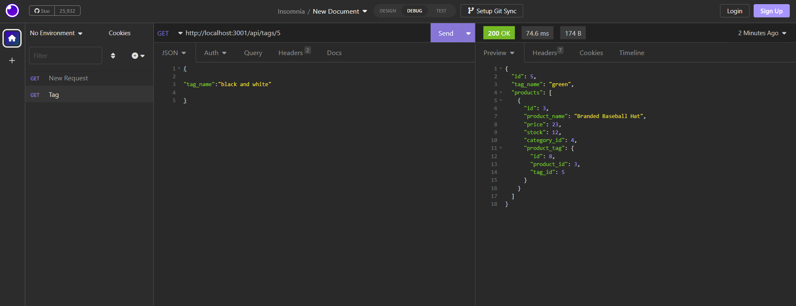

# Assignment13: E-commerce Back End

## Description
It is a backend database to update,create,viewing and delete the producr information and stock. By inputing different query string, it will getting different details of the goods as you required 
 

## License
N/A
 

## Screenshot

 

## Video Link

### Categories Capture Video:

### Product Capture Video:

### Tags Capture Video:
